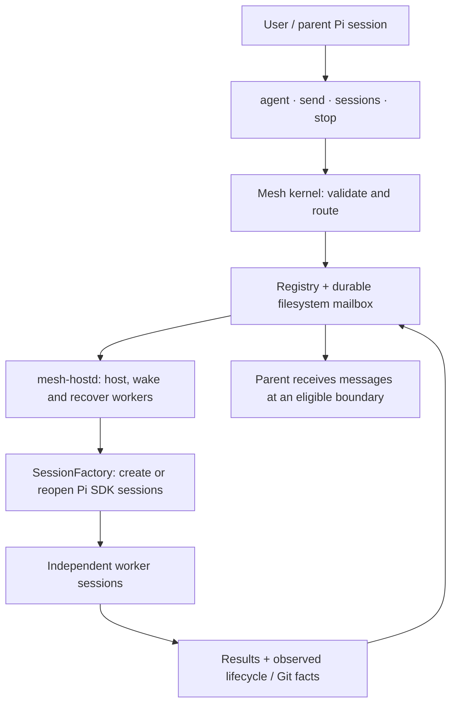

# pi-mesh

**English** | [简体中文](README.zh-CN.md)

[Detailed flowcharts](docs/ARCHITECTURE.md) · [Verification](VERIFICATION.md)

**Persistent multi-session orchestration for [Pi](https://github.com/earendil-works/pi-mono).**

A portfolio release of [Kenneth0416](https://github.com/Kenneth0416)'s Mesh extension: a TypeScript orchestration kernel that lets a Pi session delegate independent work, exchange durable messages, inspect session state, and stop workers. It extends Pi; it does not implement the underlying model client, coding tools, or terminal UI.

> **Status:** experimental, source-visible portfolio project. Original-code licensing has not yet been granted; see [NOTICE.md](NOTICE.md). Offline checks pass against published Pi 0.85.1; live model and platform acceptance are not established by those checks.

## Why Mesh?

A delegated session is not just a subprocess result. It may pause, receive new instructions, survive its original terminal, and report observed workspace facts. Mesh separates that lifecycle from the human-facing TUI, while keeping the interface to four tools:

| Tool | Purpose |
| --- | --- |
| `agent` | Start an independent Pi session with a self-contained task, optional model, thinking level, tool allowlist, working directory, and timebox. |
| `send` | Deliver instructions or results; resume a dormant worker with a work message. |
| `sessions` | Inspect your session tree or an individual session, including unread mail and usage. |
| `stop` | Abort a worker; a later work message can resume its saved context. |

`/mesh` shows an overview; `/mesh restart` requests daemon replacement. Tool descriptions and worker guidance are currently primarily Chinese.

## Installation

Requires **Node.js 24+**, Git, and Pi. The public package versions used for verification are pinned in `package-lock.json`; compatibility with older Pi releases is not claimed.

After reviewing the source and license status:

```bash
pi install git:github.com/Kenneth0416/pi-mesh
```

Restart Pi after installation. Do not load a second local copy alongside the package. Workers use your configured Pi providers and credentials and incur your model charges. They do not inherit the parent conversation: include the required context in the task.

Example request to Pi:

> Delegate a read-only review of this repository's test coverage. Give the worker read, grep, find, and ls only. Ask for concrete gaps and file references. Continue your own independent work, then summarize the review when its report arrives.

For parallel edits, prepare **one Git worktree per worker** and pass each worker its own `cwd`. Mesh reports Git facts but does not allocate worktrees, merge changes, or enforce filesystem ownership.

## Architecture



[Explore the detailed decision flows →](docs/ARCHITECTURE.md)

- **Kernel and routing** (`src/kernel.ts`, `deliver.ts`): addressing, delegation limits, tool inheritance, and messaging policy.
- **Durable mail** (`mailbox.ts`, `registry.ts`): atomic file replacement and consume-on-observe delivery. Delivery is **at least once**, not exactly once; recipients must check message IDs before repeating side effects.
- **Worker lifecycle** (`host.ts`, `hostd.ts`, `hostd-launch.ts`): detached host, heartbeat, recovery, batching, retry, and cooperative timebox notices.
- **Pi adapter** (`factory.ts`): persistent SDK sessions, deterministic tool ordering, model resolution, and worker resource loading. Child extension discovery is disabled to avoid recursive extension loading.
- **Observability** (`git.ts`, extension widget): current activity, unread mail, reported model usage, and independently observed Git workspace facts. A worker's “tests passed” text is still a claim, not test evidence.

`report` is normal work/result delivery; `blocker` requests urgent attention; `notify` does not wake dormant workers. Default guardrails limit delegation depth to two and live workers to twelve per human-root tree, with a peer wake-rate budget. A timebox is a reminder, **not** a hard kill or spending limit. Rate-limit recovery retries the same model; there is no automatic provider fallback.

## Security and operational boundaries

**This is not a sandbox or a multi-tenant security boundary.** Extensions and the daemon run with your OS permissions. A tool allowlist limits exposed tools, not filesystem or network permissions; a worker with `bash` can execute arbitrary commands. The daemon inherits the launching environment. Child sessions can load Pi settings, skills, prompts, and project context; parent extension-based permission gates are not automatically inherited.

Default Mesh state is stored under `~/.pi/agent/mesh/`; transcripts are under `~/.pi/agent/mesh-sessions/`. Mail, logs, paths, outputs, and transcripts may contain sensitive information. Protect these directories and never commit them. Mesh currently hardcodes its state base to this home-relative location, even when the Pi agent directory is customized. Separate OS accounts/containers are safer for isolation.

Session-tree filtering and cross-human message restrictions are coordination rules, not confidentiality controls: individual session inspection is global within the local registry, and filesystem access is not isolated. Closing a terminal does not necessarily stop workers. Stop workers explicitly before removing the package; package removal does not clean stored Mesh state.

The source uses POSIX-oriented process and executable discovery (`/usr/bin/env`, `which`, signals); Windows and alternate runtimes are unverified. Environment overrides include `PI_MESH_HOSTD_EXEC`, `PI_MESH_MAX_DEPTH`, `PI_MESH_TREE_MAX`, `PI_MESH_MAX_RUNNING`, and `PI_MESH_WAKE_BATCH_MS`; invalid values are not comprehensively validated.

## Development and evidence

```bash
npm ci --ignore-scripts
npm test
```

The existing test suite uses injected fake sessions, temporary directories, and simulated host launchers. It does not need model credentials. See [VERIFICATION.md](VERIFICATION.md) for exact commands, versions, results, and limitations; [TESTING.md](TESTING.md) for the manual acceptance checklist; and [中文设计说明](docs/DESIGN.zh-CN.md) for detailed design notes. The separately referenced `mesh-engineering` skill is optional policy guidance and is not bundled here.

## Detailed logic walkthrough

See the [architecture and flowcharts](docs/ARCHITECTURE.md) for source-linked diagrams of delegation, durable message delivery, worker lifecycle, and recovery. A complete [Simplified Chinese introduction](README.zh-CN.md) is also available.
