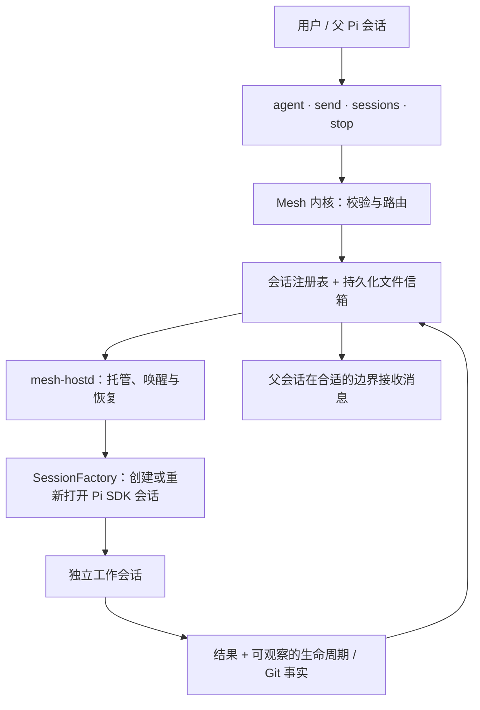

# pi-mesh

[English](README.md) | **简体中文**

[详细逻辑流程图](docs/ARCHITECTURE.zh-CN.md) · [验证记录](VERIFICATION.md)

**为 [Pi](https://github.com/earendil-works/pi-mono) 提供持久化多 Agent 会话协作。**

由 [Kenneth0416](https://github.com/Kenneth0416) 开发的 TypeScript 扩展，让 Pi 能够委派独立任务、交换持久消息、查看会话状态并停止工作会话。本项目展示的是 Pi 扩展与协作内核的开发成果；底层模型客户端、编码工具和终端界面来自 Pi 上游。

> **项目状态：** 实验性、公开源码的作品项目。原创代码的开源授权尚未确定，详见 [NOTICE.md](NOTICE.md)。已针对正式发布的 Pi 0.85.1 通过离线检查，但这不等于真实模型、完整运行生命周期或跨平台验收。

## 为什么开发 Mesh？

委派任务不应只是启动子进程并等待结果。工作会话可能暂停、接收新指令、在原终端关闭后继续运行，并汇报工作区中的可观察事实。Mesh 将这些生命周期机制从终端界面中分离出来，只提供四个核心工具：

| 工具 | 功能 |
| --- | --- |
| `agent` | 创建独立 Pi 会话，可指定任务、模型、推理等级、工具白名单、工作目录及时间提醒。 |
| `send` | 发送指令或结果；通过工作消息唤醒休眠会话。 |
| `sessions` | 查看会话树或单个会话，包括未读消息与用量。 |
| `stop` | 中止工作会话；之后可通过消息恢复已保存的上下文。 |

`/mesh` 显示概览；`/mesh restart` 请求替换守护进程。工具说明和工作会话指导目前主要使用中文。

## 安装

需要 **Node.js 24+**、Git 和 Pi。测试所用依赖由 `package-lock.json` 锁定，不承诺兼容较旧版本的 Pi。

审阅源码及授权状态后安装：

```bash
pi install git:github.com/Kenneth0416/pi-mesh
```

安装后重启 Pi。不要同时加载本机旧扩展与本包。工作会话使用你配置的模型账号并消耗额度，**不会自动获得父会话的完整对话**，请在任务书中提供必要上下文。

### 使用示例

向 Pi 提出：

> 委派一个只读会话，检查本仓库的测试覆盖。仅提供 read、grep、find、ls 工具，要求列出具体缺口及文件位置。你继续处理其他独立工作，收到报告后再总结。

并行修改代码时，先为**每个工作会话准备独立 Git worktree**，再传入对应的 `cwd`。Mesh 会报告 Git 事实，但不会自动分配 worktree、合并代码或强制文件所有权。

## 架构与开发重点



[查看详细分支与流程图 →](docs/ARCHITECTURE.zh-CN.md)

- **内核与路由**：会话寻址、委派限制、工具继承和消息策略。
- **持久消息**：原子文件替换与观察后消费；提供至少一次投递，而非恰好一次。重复执行有副作用的动作前应核对消息 ID。
- **工作会话生命周期**：独立宿主、心跳、恢复、消息合批、重试及协作式时间提醒。
- **Pi SDK 适配**：会话持久化、稳定工具顺序、模型解析和资源加载。子会话禁用扩展发现，避免递归加载扩展。
- **可观察性**：当前活动、未读消息、模型用量与独立采集的 Git 工作区事实。工作会话声称“测试通过”仍不等于实际验证证据。

消息意图：`report` 用于普通工作与汇报；`blocker` 用于紧急请求；`notify` 不唤醒休眠会话。默认委派深度最多两层，同一人类根会话树最多十二个活跃工作会话，并限制同伴互相唤醒的频率。时间提醒**不是强制终止或花费上限**。限流重试使用原模型，不会自动切换供应商。

## 安全与运行边界

**Mesh 不是沙箱，也不是多租户安全隔离机制。** 扩展和守护进程以你的系统权限运行；工具白名单只限制暴露的工具，不限制文件系统或网络权限。有 `bash` 的会话可以执行任意命令。守护进程继承启动环境，子会话可能加载 Pi 配置、技能、提示和项目上下文；父会话基于扩展的权限检查不会自动继承。

运行状态位于 `~/.pi/agent/mesh/`，会话记录位于 `~/.pi/agent/mesh-sessions/`。这些目录可能包含私人消息、路径、输出和日志，**不要提交到 Git**。当前 Mesh 状态位置固定相对于 HOME，即使自定义 Pi agent 目录也不会跟随改变。需要更强隔离时使用不同系统账号或容器。

会话树过滤与跨人类会话消息限制是协作规则，不是保密控制；单会话检查在本机注册表范围内是全局的。关闭终端不一定停止工作会话，卸载前应显式停止；卸载不会自动清理历史状态。

实现使用面向 POSIX 的进程启动、`which` 和信号；Windows、替代运行时尚未验收。环境覆盖项包括 `PI_MESH_HOSTD_EXEC`、`PI_MESH_MAX_DEPTH`、`PI_MESH_TREE_MAX`、`PI_MESH_MAX_RUNNING` 和 `PI_MESH_WAKE_BATCH_MS`，无效值尚未得到全面校验。

## 开发与验证

```bash
npm ci --ignore-scripts
npm test
```

类型检查及 **132 项测试通过**。现有测试使用注入的模拟会话、临时目录和模拟宿主启动器，不需要模型凭据；未据此宣称真实模型性能提升、成本降低或生产可靠性。

- [验证记录](VERIFICATION.md)：实际执行命令、依赖版本及未验证项目。
- [测试说明](TESTING.md)：人工验收清单。
- [中文设计说明](docs/DESIGN.zh-CN.md)：详细消息和生命周期设计。

设计文档提及的 `mesh-engineering` 技能是可选策略指导，不包含在本包中。原创代码授权状态及上游归属见 [NOTICE.md](NOTICE.md)。
