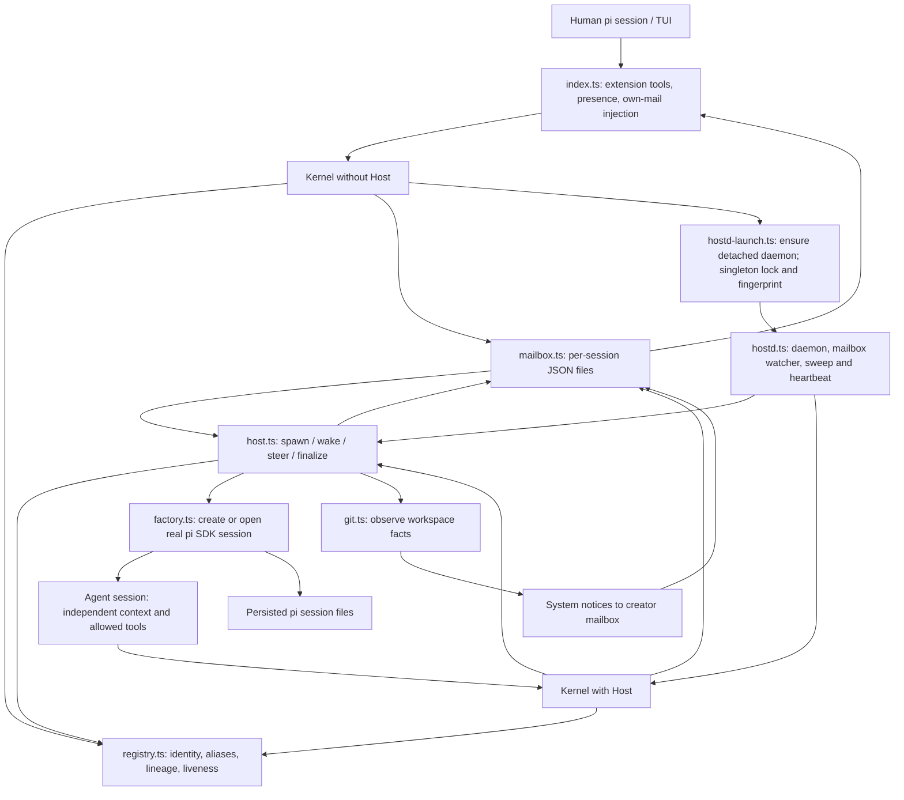
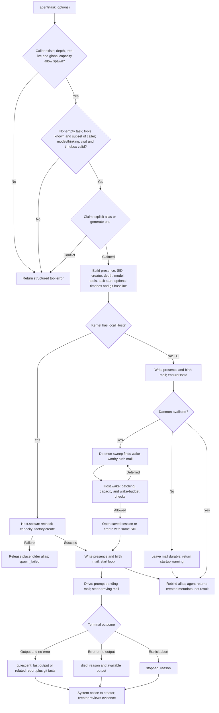
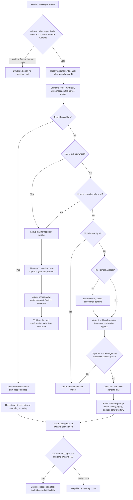
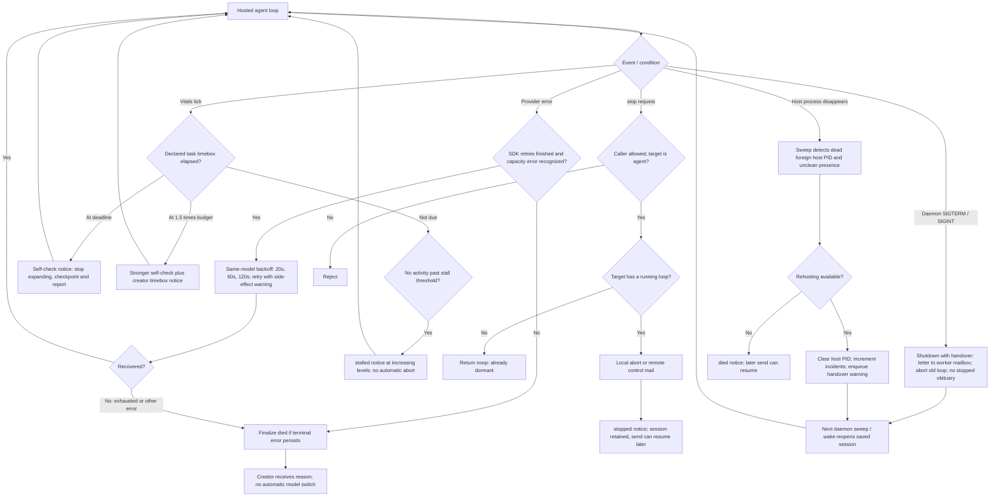

# Architecture and logic flowcharts

[README](../README.md) · English (default) | [简体中文](ARCHITECTURE.zh-CN.md)

These diagrams describe the current implementation, not a distributed queue specification. Labels such as `quiescent` and `died` are recorded facts; they are not task acceptance decisions. Mermaid blocks render on GitHub.

## 1. Architecture: two entry points, one kernel

- [index.ts](../index.ts) hosts the human-facing integration, not the worker execution loops. Closing a terminal is therefore not inherently a worker stop.
- [kernel.ts](../src/kernel.ts) implements `agent`, `send`, `sessions`, and `stop` for both entry points. [tools.ts](../src/tools.ts) maps public argument names to kernel arguments.
- [hostd.ts](../src/hostd.ts) owns the [Host](../src/host.ts). Filesystem notifications provide prompt delivery; periodic sweep provides a fallback. Defaults are 15-second sweep/heartbeat and 10-minute daemon idle exit; pending wake-worthy agent mail prevents idle exit.
- [factory.ts](../src/factory.ts) disables recursive extension loading, installs mesh custom tools, and opens an existing session file or creates a session with the intended ID when the file is absent.
- [registry.ts](../src/registry.ts), [mailbox.ts](../src/mailbox.ts), and session files are distinct storage layers. `sessions()` lists the caller's scoped tree; `sessions({id})` can inspect a particular session more broadly. Inspection is not message consumption.

## 2. Delegation: validation, persistence, execution, return

Source: [kernel agent](../src/kernel.ts), [Host spawn/wake/drive/finalize](../src/host.ts), [factory](../src/factory.ts), [limits and defaults](../src/types.ts).

Defaults: depth 2, 12 live agents per tree, no finite global running limit unless configured. Model inherits unless supplied; thinking is explicit, inherited, or `medium` when unknown. Native tools cannot be broadened by delegation; depth also determines whether the child receives the `agent` verb. These are tool-surface checks, **not an OS sandbox**. `cwd` must exist, but mesh does not create or isolate git worktrees: assign a separate worktree to each concurrent writer yourself.

The TUI can return `created` even when daemon startup failed: presence and birth mail already exist. Wake/open failure reports `died` and leaves mail pending. Quiet termination means the agent stopped producing output, not that the requested work was correct or complete. Final notices can clip output; inspect the saved session for the full record.

## 3. Message routing and consume-on-observe

Source: [route](../src/deliver.ts), [send](../src/kernel.ts), [mailbox and planner](../src/mailbox.ts), [host event subscription](../src/host.ts), [TUI integration](../index.ts), [injection gate](../src/inject-gate.ts).

- `report` is the default. `blocker` is urgent. `notify` never wakes a dormant agent, but can still reach a running recipient. A dormant human is never started by mail. Agents cannot message another human root (`foreign_human`); this is not a general secrecy boundary between agents.
- Dormant-agent wake batching defaults to a fixed 8 seconds, not an endlessly resetting debounce. Wake-budget throttling applies to agent exchanges; human messages bypass/reset that budget. Sweep also treats `quiescent` and `died` notices as wake-worthy, but not `stopped`, `stalled`, `timebox`, or `workspace` notices.
- The human TUI has a separate injection gate: ordinary messages wait for quiet/minimum hold, with a maximum hold. Hosted running agents instead steer newly arrived mail directly; do not assume the TUI's batching gate applies to them.
- The planner uses count and rendered-character budgets, priority and aging. It retains overflow with envelope summaries; it may drop superseded `stalled`/`timebox` snapshots for the same subject. One oversized message is still eligible. Live hosted steering is not the same bounded batching path.
- **At-least-once, not exactly-once:** the hosted loop deletes normal mail only after observing its ID in a user-message event. A crash between observation and deletion can replay it. This is neither proof of task completion nor an atomic transaction with filesystem/tool side effects. Check message IDs and verify side effects before retrying. Control mail is consumed separately before handling; malformed JSON files are removed when read.

## 4. Recovery, timeboxes, stopping and daemon handover

Source: [Host recovery/checkVitals/shutdown/sweep](../src/host.ts), [kernel stop and timebox reset](../src/kernel.ts), [daemon lifecycle](../src/hostd.ts), [launcher](../src/hostd-launch.ts).

Timeboxes are opt-in wall-clock budgets anchored to task creation. Wake and provider retries do not reset them; checks run on hosted loops, not as a hard deadline scheduler for dormant sessions. `send(timebox_min)` resets the remaining allowance from now and is permitted for a human or the target's creator, not for the worker itself. A tick that first observes a 1.5× overrun can go directly to that level. Stalls and timebox overruns **do not force-stop**.

`stop` is an explicit agent-session abort, not rollback, deletion, or a guarantee that arbitrary subprocess side effects have been undone. It is not a recursive tree-stop operation. Daemon handover similarly warns that the preceding action may have partially executed. Recovery requires a daemon to be running or started again; persistent mail alone cannot execute work. The daemon uses a singleton lock, but this local-filesystem design does not promise distributed consensus, transactional task execution, or automatic workspace conflict resolution.
