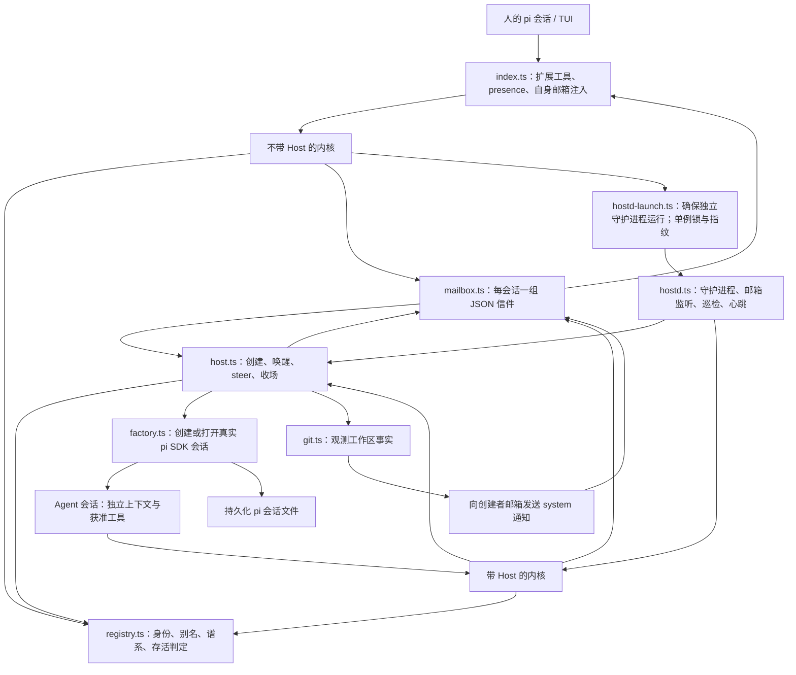
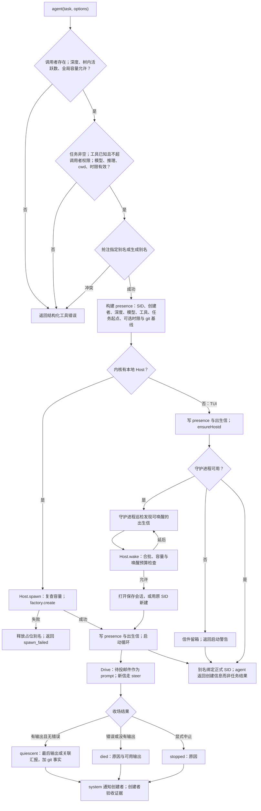
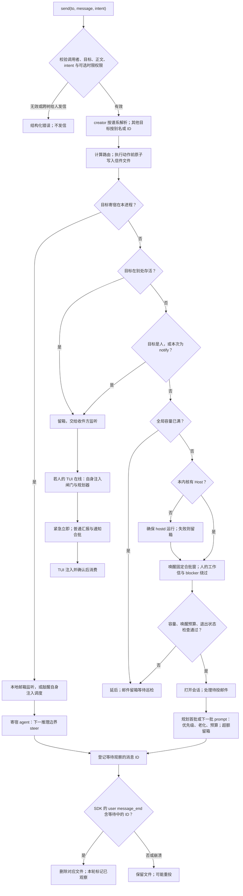
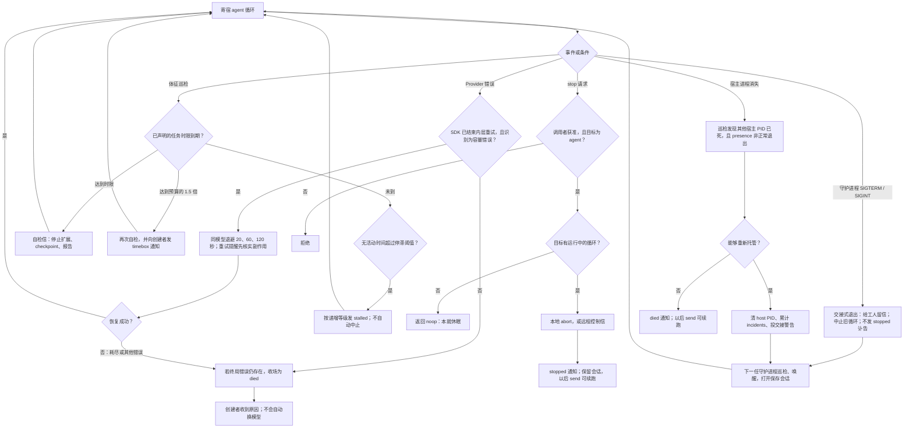

# 架构与逻辑流程图

[中文 README](../README.zh-CN.md) · [English（默认）](ARCHITECTURE.md) | 简体中文

以下图示描述当前实现，不是分布式队列规范。`quiescent`、`died` 等标签是观测事实，不代表任务验收结论。GitHub 可直接渲染 Mermaid 图。

## 1. 架构：两个入口，共用一个内核

- [index.ts](../index.ts) 负责人的交互集成，不运行工人循环。因此关闭终端本身不等于停止工人。
- [kernel.ts](../src/kernel.ts) 为两种入口统一实现 `agent`、`send`、`sessions`、`stop`；[tools.ts](../src/tools.ts) 将公开参数映射为内核参数。
- [hostd.ts](../src/hostd.ts) 持有 [Host](../src/host.ts)。文件系统监听负责及时响应，定期 sweep 兜底。默认巡检与心跳为 15 秒，连续空闲 10 分钟后守护进程退出；存在值得唤醒 agent 的待投邮件时不算空闲。
- [factory.ts](../src/factory.ts) 禁止递归加载扩展，安装 mesh 自定义工具；已有会话文件则打开，文件缺失则使用预定 ID 新建。
- [registry.ts](../src/registry.ts)、[mailbox.ts](../src/mailbox.ts) 与会话文件是不同存储层。`sessions()` 列出调用者范围内的会话树；`sessions({id})` 可以更广泛地深查指定会话。查看不等于消费邮件。

## 2. 委派：校验、落盘、执行、返回

源码：[kernel agent](../src/kernel.ts)、[Host spawn/wake/drive/finalize](../src/host.ts)、[factory](../src/factory.ts)、[限制与默认值](../src/types.ts)。

默认最大深度 2、每树最多 12 个活跃 agent；全局运行数默认无有限上限，可配置。未指定模型则继承；推理等级依次采用显式值、继承值、未知时的 `medium`。委派不能扩大原生工具白名单；子会话的深度还决定其是否获得 `agent` 动词。这些只是工具入口约束，**不是操作系统沙箱**。`cwd` 必须存在，但 mesh 不会创建或隔离 git worktree：并发写同一仓库时，应自行给每位写入者分配独立 worktree。

TUI 在守护进程启动失败时仍可能返回 `created`：presence 和出生信已经落盘。唤醒时打开失败会发 `died`，邮件仍留箱。归于安静只代表停止输出，不证明任务正确或完成。最终通知可能截断输出；全文以保存的会话记录为准。

## 3. 消息路由与观察后消费

源码：[route](../src/deliver.ts)、[send](../src/kernel.ts)、[邮箱与规划器](../src/mailbox.ts)、[Host 事件订阅](../src/host.ts)、[TUI 集成](../index.ts)、[注入闸门](../src/inject-gate.ts)。

- `report` 是默认值，`blocker` 是紧急求助。`notify` 不唤醒休眠 agent，但仍可送给运行中的收件人。邮件不会启动休眠的人会话。Agent 不能给另一 human root 发信（`foreign_human`）；这不代表 agent 之间存在普遍的信息保密边界。
- 休眠 agent 默认使用固定 8 秒唤醒合批窗，不会因持续来信无限延期。Agent 互发消息受唤醒预算限制；人的消息绕过并清空该预算。巡检也把 `quiescent`、`died` 通知视为可唤醒消息，但 `stopped`、`stalled`、`timebox`、`workspace` 不会触发唤醒。
- 人的 TUI 有独立注入闸门：普通消息等待静默与最短持有时间，并有最大持有时间。运行中的寄宿 agent 则直接对新信调用 steer，不能把 TUI 的合批规则套用到它们身上。
- 规划器按封数、渲染后字符数、优先级和老化安排批次。超额信件保留，只给信封摘要；同一主体的旧 `stalled` / `timebox` 快照可被新快照替代删除。单封超预算仍可进入批次。运行中的直接 steer 不是同一条限量合批路径。
- **至少一次，而非恰好一次：** 寄宿循环只有在 user 消息事件中观察到 ID 后才删除普通邮件。观察与删除之间崩溃仍可能重投。观察不代表任务完成，也不与工具或文件系统副作用构成原子事务。重试前检查消息 ID 与副作用。控制信另行提前消费；读取时发现损坏 JSON 会删除该文件。

## 4. 恢复、时限、停止与守护进程交接

源码：[Host recover/checkVitals/shutdown/sweep](../src/host.ts)、[kernel stop 与时限重设](../src/kernel.ts)、[守护进程生命周期](../src/hostd.ts)、[启动器](../src/hostd-launch.ts)。

时限只有声明才有，使用任务创建时刻起算的墙钟。唤醒和 provider 重试不重置时限；检查针对寄宿循环，并非针对休眠会话的硬截止调度器。`send(timebox_min)` 从现在起重设剩余时间，仅人或目标的创建者有权操作，工人不能自行续期。若某次巡检首次发现已经超过 1.5 倍，可直接进入第二级。停滞与超时**不会强制停止**。

`stop` 是显式中止 agent 会话，不是回滚、删除，也不保证撤销任意子进程副作用；它不是递归停止整树。守护进程交接同样会提醒上一步可能只执行了一半。恢复需要守护进程正在运行或被再次启动；持久化邮件本身不会执行任务。守护进程虽使用单例锁，这一本地文件系统设计并不承诺分布式共识、事务式任务执行或自动解决工作区冲突。
